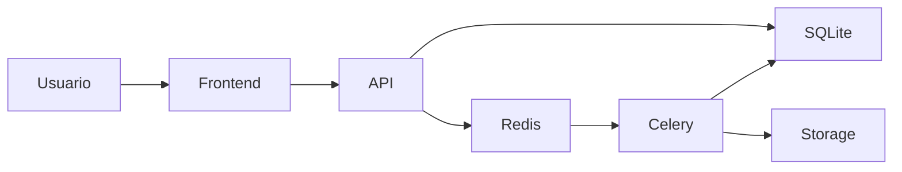
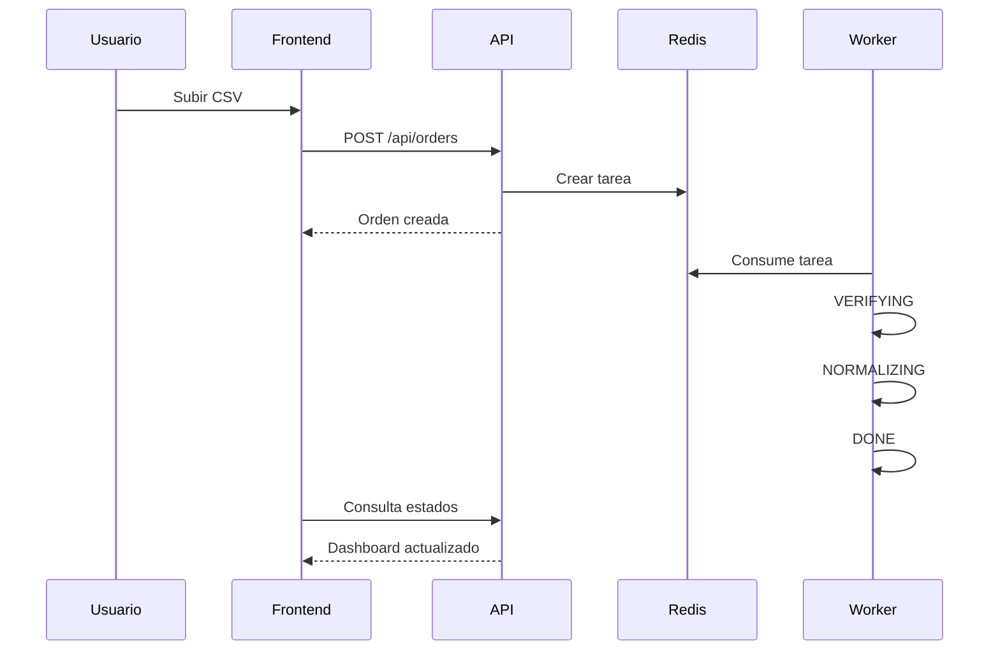

# DataINC Processing Dashboard

## Descripción

DataINC es una plataforma para el procesamiento de archivos CSV de forma asíncrona.

La solución permite a los clientes subir archivos CSV, procesarlos mediante un pipeline de validación y normalización, monitorear el estado de cada orden y descargar el resultado final.

---

## Características

### Procesamiento Asíncrono

Las órdenes son procesadas utilizando Celery y Redis, evitando bloquear el hilo principal de la API.

### Procesamiento Paralelo

El sistema soporta múltiples órdenes concurrentes mediante workers configurados con concurrencia.

### Pipeline de Procesamiento

Cada archivo atraviesa las siguientes etapas:

```text
CREATED
↓
VERIFYING
↓
NORMALIZING
↓
DONE
```

#### VERIFYING

Se valida:

- Existencia de columnas requeridas.
- Estructura del CSV.
- Headers válidos.

#### NORMALIZING

Se aplican las siguientes transformaciones:

- Fechas → ISO 8601.
- Texto → MAYÚSCULAS.
- Valores vacíos → NULL.

---

## Dashboard

El dashboard permite visualizar:

- Historial cronológico de órdenes.
- Estado actual.
- Cantidad de registros procesados.
- Tiempo total de procesamiento.
- Timeline completo de estados.
- Descarga del archivo resultante.

---

## Arquitectura

### Tecnologías

#### Frontend

- Vue 3
- TypeScript
- Axios

#### Backend

- Django
- Django REST Framework

#### Procesamiento

- Celery
- Redis

#### Infraestructura

- Docker
- Docker Compose

### Diagrama



---

## Flujo de Procesamiento



---

## Ejecución Local

### Requisitos

- Docker
- Docker Compose

### Levantar el proyecto

```bash
docker compose up --build
```

### Frontend

```text
http://localhost:5173
```

### Backend

```text
http://localhost:8000
```

### API

```text
http://localhost:8000/api/orders/
```

---

## Endpoints

### Crear Orden

```http
POST /api/orders/
```

Body:

```multipart
original_file=<csv>
```

### Listar Órdenes

```http
GET /api/orders/
```

### Descargar Archivo Procesado

```http
GET /api/orders/{id}/download/
```

---

## Decisiones Técnicas

### Celery + Redis

Permiten desacoplar el procesamiento de archivos de las peticiones HTTP.

### Historial de Estados

Cada transición de estado queda registrada para mejorar la trazabilidad y observabilidad del sistema.

### Polling Inteligente

El frontend consulta periódicamente la API únicamente cuando existen órdenes activas.

---

## Mejoras Futuras

- PostgreSQL.
- WebSockets mediante Django Channels.
- Autenticación JWT.
- Almacenamiento en S3.
- Métricas con Prometheus y Grafana.
- CI/CD.
- Tests automatizados.

---

## Uso de IA

Durante el desarrollo se utilizaron herramientas de IA para acelerar tareas de implementación, documentación y diseño de arquitectura siguiendo un enfoque Spec Driven Development.