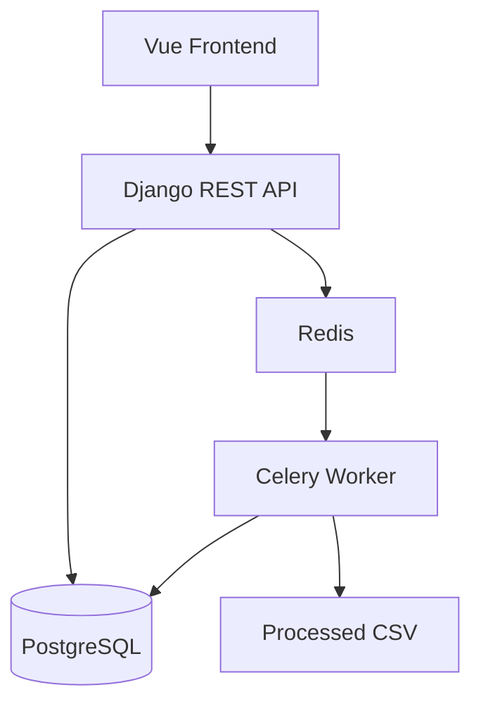

# Arquitectura

## Componentes

### Frontend

- Vue 3
- TypeScript
- Vite

### Backend

- Django REST Framework

### Procesamiento Asíncrono

- Celery

### Message Broker

- Redis

### Persistencia

- PostgreSQL

---

## Diagrama



## 2. Decisiones técnicas

```md
## Asynchronous processing

CSV processing runs in Celery workers instead of the Django request thread.

This prevents the API from being blocked while large files are processed.

## Parallel execution

Celery workers run with concurrency enabled, allowing multiple orders to be processed in parallel.

## Status history

Each order stores a status timeline to improve observability and traceability.

## Smart polling

The frontend refreshes the dashboard only while there are active orders.

WebSockets were not implemented because the challenge explicitly allows polling and the current approach keeps the architecture simple.

## File storage

Original and processed files are stored in Django media storage for local development.

In production, this could be replaced by S3-compatible object storage.